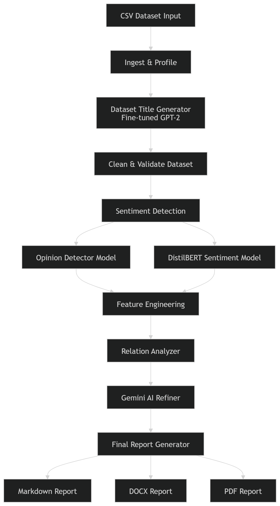

Your current README is **very good technically**, but it is missing the **GitHub presentation style** that your other repos now follow (badges, demo section, stars, cleaner intro).
We will **refine it without changing the technical content** — just make it **more professional and consistent with Shared Diary / Clinic / Portfolio repos**.

Below is a **refined version of your README header + structure improvements**.
You can replace the **top part** of your README with this.

---

# 🧠 AI Insight Pipeline

<p align="center">
End-to-End Automated Data Analysis, Sentiment Detection, Feature Engineering, Insights & Report Generation
</p>

<p align="center">


</p>

<p align="center">


</p>

---

# 📖 Project Overview

The **AI Insight Pipeline** is a fully automated system that transforms any **CSV dataset into a complete analytical report**.

The pipeline performs the entire workflow automatically:

* dataset profiling
* cleaning & validation
* sentiment detection
* feature engineering
* statistical relation analysis
* AI-generated insights
* professional PDF / DOCX reporting

All steps run in a **single automated pipeline**, requiring only minimal user input.

The system asks the user to provide:

1️⃣ **Primary Target Column**
2️⃣ **Secondary Target(s)** *(optional, up to 2)*
3️⃣ **Task Type** *(classification or regression)*

After this, the entire analysis runs automatically.

**Goal:**
Create a system that makes **dataset analysis automatic, intelligent, and production-ready** without manual coding.

---

# ⚙️ Pipeline Architecture

<p align="center">

</p>

The AI Insight Pipeline processes datasets through a multi-stage automated workflow including profiling, cleaning, sentiment analysis, feature engineering, statistical relation analysis, LLM-powered summarization, and final report generation.

---

# ✨ Features Overview

## 🔹 1. CSV Profiling

* Safe CSV loading with encoding detection
* Generates JSON dataset profile
* Detects column types automatically:

- numeric
- categorical
- text
- datetime

---

## 🔹 2. Dataset Title Generation (Fine-Tuned GPT-2)

The pipeline generates a **professional dataset title automatically**.

Features:

* dataset structure summarization
* domain inference
* fine-tuned GPT-2 model
* saved under

```
results/<dataset>/title/
```

---

## 🔹 3. Clean & Validate

User provides:

* **Primary Target**
* **Secondary Targets (optional)**
* **Task Type**

The pipeline then performs:

* datatype correction
* invalid column removal
* datetime normalization
* categorical compression

Outputs:

```
cleaned_dataset.csv
targets.json
```

---

## 🔹 4. Sentiment Detection

The pipeline supports **two sentiment modes**.

### ✔ Case A — Existing Sentiment Column

If dataset already contains sentiment labels:

```
positive
neutral
negative
```

They are automatically converted into numeric format.

---

### ✔ Case B — No Sentiment → Use AI Models

The pipeline runs two internal models:

**Opinion Detector**
Detects whether text expresses an opinion.

**DistilBERT Sentiment Model**

Classifies text as:

* positive
* neutral
* negative

Features:

* GPU acceleration
* batching
* caching
* automatic preprocessing

Additional columns generated:

```
<column>_sentiment
<column>_sentiment_num
<column>_sentiment_confidence
```

---

## 🔹 5. Feature Engineering

Automatically generates advanced features including:

### Numeric

* z-score normalization

### Categorical

* label encoding
* frequency encoding

### Text

* word count
* emoji detection
* URL detection
* uppercase ratio

### Datetime

* year
* month
* weekday
* hour

Outputs:

```
<dataset>_features.csv
encoders.json
```

---

## 🔹 6. Relation Analyzer

The system detects **important statistical relationships** between features.

Methods used:

* Pearson correlation
* Spearman correlation
* ANOVA Eta²
* Chi-Square / Cramer’s V

Quality filters:

```
effect size ≥ 0.15
p-value ≤ 0.05
minimum sample thresholds
```

Results include:

* best relations
* visual plots
* explanation sentences

Saved as:

```
relations.json
relations_sentences.json
```

---

## 🔹 7. Gemini AI Summary

The pipeline uses **Gemini 2.5 Flash** to generate:

* final dataset summary
* actionable recommendations

Outputs saved as:

```
summary.json
summary.md
```

---

## 🔹 8. Final Report Generator

Automatically produces professional reports:

* Markdown
* DOCX
* PDF

Reports include:

1️⃣ dataset title
2️⃣ dataset overview
3️⃣ column analysis
4️⃣ sentiment distribution
5️⃣ key relations with plots
6️⃣ AI-generated insights
7️⃣ recommendations

---

# 📂 Folder Structure

```
pipeline/
 ├── ingest_and_profile.py
 ├── title_generator.py
 ├── detect_and_annotate_csv.py
 ├── feature_engineer.py
 ├── relation_analyzer.py
 ├── gemini_refiner.py
 ├── final_report.py
 └── run_pipeline.py
```

```
results/<dataset>/
 ├── profiles
 ├── cleaned
 ├── enriched
 ├── features
 ├── relations
 ├── gemini
 └── report
```

---

# 🚀 Running the Pipeline

### 1️⃣ Place CSV inside

```
data/all_csv
```

---

### 2️⃣ Run

```
app.ipynb
```

---

### 3️⃣ Enter configuration

Example:

```
Primary Target: rating
Secondary Target: sentiment
Task Type: classification
```

---

### 4️⃣ Pipeline runs automatically

Outputs appear in:

```
results/<dataset>/
```

---

# 📦 Installation

```
pip install -r requirements.txt
```

Set API key:

```
export GOOGLE_API_KEY="your_key"
```

---

# 👨‍💻 Author

**Keshav**
B.Tech Computer Science & Engineering
Bennett University

---

# ⭐ Support

If you like this project, consider giving it a **star ⭐ on GitHub**.

---

### One thing I recommend (very important for this repo)

Add **screenshots of generated reports** like:

```
screenshots/
 ├── pipeline_flow.png
 ├── relations_plot.png
 ├── final_report.png
```

Because **AI repos look much more impressive with visuals**.

---

If you want, I can also show you **3 small changes that will make this repo look like a real research-level GitHub project (seriously impressive for recruiters)**.
